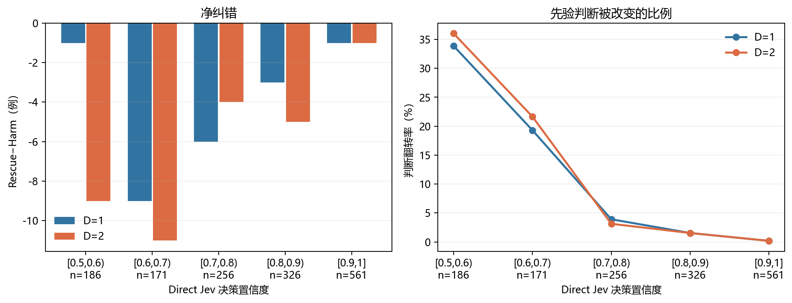

# Direct Jev 置信度分桶与 Prior-EW-QBAF 修正分析

生成时间：2026-09-27 10:53:41 中国标准时间

## 定义

- 使用现有逐样本结果：`experiment_results/prior_full/data`；没有发起 API 请求。
- `direct_jev` 给出论点为真的概率 p。分桶所用置信度为 c=max(p,1−p)，即 Jev 对其所选真假类别的置信度。因此真假两侧被对称分桶；恰好位于边界的样本进入右侧桶，1.0 进入末桶。
- 两种方法均以概率严格大于 0.5 判真。Rescue 指 Direct Jev 判错而 Prior-EW-QBAF 判对；Harm 指反方向。Rescue−Harm 除以桶内样本数，恰好等于后者减前者的 Accuracy。
- Brier 是真类概率与 0/1 标签的平方误差均值；翻转率为两方法真假判断不同的样本占比。95% 区间对同一桶的逐样本差值做 2000 次配对重抽样，未经多重比较校正。
- D=1 与 D=2 共享同一批根论点；以下按深度分开计算，不会将两个深度当作独立样本合并。

## 三数据集合计

| 深度 | Jev 置信度桶 | n | Direct Acc | Prior-EW Acc | Rescue | Harm | Rescue−Harm | Direct Brier | Prior-EW Brier | 翻转率 |
|---|---|---:|---:|---:|---:|---:|---:|---:|---:|---:|
| D=1 | [0.5,0.6) | 186 | 0.5376 | 0.5323 | 31 | 32 | -1 | 0.2480 | 0.2804 | 0.3387 |
| D=1 | [0.6,0.7) | 171 | 0.6608 | 0.6082 | 12 | 21 | -9 | 0.2246 | 0.2494 | 0.1930 |
| D=1 | [0.7,0.8) | 256 | 0.7578 | 0.7344 | 2 | 8 | -6 | 0.1813 | 0.2029 | 0.0391 |
| D=1 | [0.8,0.9) | 326 | 0.8773 | 0.8681 | 1 | 4 | -3 | 0.1067 | 0.1090 | 0.0153 |
| D=1 | [0.9,1] | 561 | 0.9643 | 0.9626 | 0 | 1 | -1 | 0.0348 | 0.0357 | 0.0018 |
| D=2 | [0.5,0.6) | 186 | 0.5376 | 0.4892 | 29 | 38 | -9 | 0.2480 | 0.2909 | 0.3602 |
| D=2 | [0.6,0.7) | 171 | 0.6608 | 0.5965 | 13 | 24 | -11 | 0.2246 | 0.2553 | 0.2164 |
| D=2 | [0.7,0.8) | 256 | 0.7578 | 0.7422 | 2 | 6 | -4 | 0.1813 | 0.2060 | 0.0312 |
| D=2 | [0.8,0.9) | 326 | 0.8773 | 0.8620 | 0 | 5 | -5 | 0.1067 | 0.1126 | 0.0153 |
| D=2 | [0.9,1] | 561 | 0.9643 | 0.9626 | 0 | 1 | -1 | 0.0348 | 0.0360 | 0.0018 |

## 接近阈值与高置信对照

| 深度 | 范围 | n | Rescue | Harm | Rescue−Harm | ΔAccuracy [95%区间] | ΔBrier [95%区间] | 翻转率 |
|---|---|---:|---:|---:|---:|---:|---:|---:|
| D=1 | 接近阈值 [0.5,0.7) | 357 | 43 | 53 | -10 | -0.0280 [-0.0812, +0.0252] | +0.0287 [+0.0083, +0.0499] | 0.2689 |
| D=1 | 高置信 [0.9,1] | 561 | 0 | 1 | -1 | -0.0018 [-0.0053, +0.0000] | +0.0010 [-0.0008, +0.0028] | 0.0018 |
| D=2 | 接近阈值 [0.5,0.7) | 357 | 42 | 62 | -20 | -0.0560 [-0.1120, +0.0000] | +0.0371 [+0.0153, +0.0593] | 0.2913 |
| D=2 | 高置信 [0.9,1] | 561 | 0 | 1 | -1 | -0.0018 [-0.0053, +0.0000] | +0.0012 [-0.0006, +0.0033] | 0.0018 |

## 各数据集分桶

| 数据集 | 深度 | Jev 置信度桶 | n | Direct Acc | Prior-EW Acc | Rescue | Harm | Rescue−Harm | Direct Brier | Prior-EW Brier | 翻转率 |
|---|---|---|---:|---:|---:|---:|---:|---:|---:|---:|---:|
| TruthfulClaim | D=1 | [0.5,0.6) | 38 | 0.5526 | 0.5263 | 4 | 5 | -1 | 0.2540 | 0.2945 | 0.2368 |
| TruthfulClaim | D=1 | [0.6,0.7) | 52 | 0.6346 | 0.5769 | 2 | 5 | -3 | 0.2290 | 0.2576 | 0.1346 |
| TruthfulClaim | D=1 | [0.7,0.8) | 68 | 0.8088 | 0.8088 | 2 | 2 | +0 | 0.1567 | 0.1549 | 0.0588 |
| TruthfulClaim | D=1 | [0.8,0.9) | 120 | 0.9417 | 0.9167 | 0 | 3 | -3 | 0.0638 | 0.0630 | 0.0250 |
| TruthfulClaim | D=1 | [0.9,1] | 222 | 0.9595 | 0.9550 | 0 | 1 | -1 | 0.0391 | 0.0423 | 0.0045 |
| StrategyClaim | D=1 | [0.5,0.6) | 84 | 0.4762 | 0.4643 | 15 | 16 | -1 | 0.2529 | 0.2931 | 0.3690 |
| StrategyClaim | D=1 | [0.6,0.7) | 71 | 0.7042 | 0.6479 | 5 | 9 | -4 | 0.2120 | 0.2295 | 0.1972 |
| StrategyClaim | D=1 | [0.7,0.8) | 88 | 0.7386 | 0.7159 | 0 | 2 | -2 | 0.1918 | 0.2139 | 0.0227 |
| StrategyClaim | D=1 | [0.8,0.9) | 95 | 0.8421 | 0.8421 | 1 | 1 | +0 | 0.1308 | 0.1294 | 0.0211 |
| StrategyClaim | D=1 | [0.9,1] | 162 | 0.9691 | 0.9691 | 0 | 0 | +0 | 0.0297 | 0.0293 | 0.0000 |
| MedClaim | D=1 | [0.5,0.6) | 64 | 0.6094 | 0.6250 | 12 | 11 | +1 | 0.2382 | 0.2552 | 0.3594 |
| MedClaim | D=1 | [0.6,0.7) | 48 | 0.6250 | 0.5833 | 5 | 7 | -2 | 0.2383 | 0.2699 | 0.2500 |
| MedClaim | D=1 | [0.7,0.8) | 100 | 0.7400 | 0.7000 | 0 | 4 | -4 | 0.1889 | 0.2259 | 0.0400 |
| MedClaim | D=1 | [0.8,0.9) | 111 | 0.8378 | 0.8378 | 0 | 0 | +0 | 0.1325 | 0.1413 | 0.0000 |
| MedClaim | D=1 | [0.9,1] | 177 | 0.9661 | 0.9661 | 0 | 0 | +0 | 0.0339 | 0.0333 | 0.0000 |
| TruthfulClaim | D=2 | [0.5,0.6) | 38 | 0.5526 | 0.5000 | 5 | 7 | -2 | 0.2540 | 0.3007 | 0.3158 |
| TruthfulClaim | D=2 | [0.6,0.7) | 52 | 0.6346 | 0.5962 | 4 | 6 | -2 | 0.2290 | 0.2646 | 0.1923 |
| TruthfulClaim | D=2 | [0.7,0.8) | 68 | 0.8088 | 0.8235 | 2 | 1 | +1 | 0.1567 | 0.1514 | 0.0441 |
| TruthfulClaim | D=2 | [0.8,0.9) | 120 | 0.9417 | 0.9167 | 0 | 3 | -3 | 0.0638 | 0.0644 | 0.0250 |
| TruthfulClaim | D=2 | [0.9,1] | 222 | 0.9595 | 0.9550 | 0 | 1 | -1 | 0.0391 | 0.0427 | 0.0045 |
| StrategyClaim | D=2 | [0.5,0.6) | 84 | 0.4762 | 0.4286 | 14 | 18 | -4 | 0.2529 | 0.3044 | 0.3810 |
| StrategyClaim | D=2 | [0.6,0.7) | 71 | 0.7042 | 0.6197 | 5 | 11 | -6 | 0.2120 | 0.2365 | 0.2254 |
| StrategyClaim | D=2 | [0.7,0.8) | 88 | 0.7386 | 0.7159 | 0 | 2 | -2 | 0.1918 | 0.2190 | 0.0227 |
| StrategyClaim | D=2 | [0.8,0.9) | 95 | 0.8421 | 0.8211 | 0 | 2 | -2 | 0.1308 | 0.1361 | 0.0211 |
| StrategyClaim | D=2 | [0.9,1] | 162 | 0.9691 | 0.9691 | 0 | 0 | +0 | 0.0297 | 0.0296 | 0.0000 |
| MedClaim | D=2 | [0.5,0.6) | 64 | 0.6094 | 0.5625 | 10 | 13 | -3 | 0.2382 | 0.2675 | 0.3594 |
| MedClaim | D=2 | [0.6,0.7) | 48 | 0.6250 | 0.5625 | 4 | 7 | -3 | 0.2383 | 0.2731 | 0.2292 |
| MedClaim | D=2 | [0.7,0.8) | 100 | 0.7400 | 0.7100 | 0 | 3 | -3 | 0.1889 | 0.2316 | 0.0300 |
| MedClaim | D=2 | [0.8,0.9) | 111 | 0.8378 | 0.8378 | 0 | 0 | +0 | 0.1325 | 0.1447 | 0.0000 |
| MedClaim | D=2 | [0.9,1] | 177 | 0.9661 | 0.9661 | 0 | 0 | +0 | 0.0339 | 0.0335 | 0.0000 |

## 对假设的判断

- D=1：最接近 0.5 的桶翻转 63/186 条，Rescue/Harm 为 31/32，Brier 从 0.2480 变为 0.2804；合并的 [0.5,0.7) 区间 Rescue−Harm 为 -10。高置信 [0.9,1] 桶翻转 1/561 条，Rescue/Harm 为 0/1。
- D=2：最接近 0.5 的桶翻转 67/186 条，Rescue/Harm 为 29/38，Brier 从 0.2480 变为 0.2909；合并的 [0.5,0.7) 区间 Rescue−Harm 为 -20。高置信 [0.9,1] 桶翻转 1/561 条，Rescue/Harm 为 0/1。
- 三数据集合计的十个深度—置信度桶中，Rescue−Harm 均未为正；接近 0.5 时虽有更多判断翻转，本次 Prior-EW-QBAF 没有由此获得净纠错优势。
- [0.5,0.7) 区间两个深度的 Brier 都升高，其逐样本配对 95% 区间下界均大于 0。
- 高置信桶翻转极少，现有数据更直接支持“结构化论证几乎不改变高置信判断”；仅凭稀少的翻转，不能断言它在该桶有稳定的有害或有益效果。低置信桶未见总体正价值，但不排除其他图生成或论点评分设置得到不同结果。

本分析按已观察到的置信度分组，属于探索性条件比较。同一根论点的两个深度不可当作独立重复，单个数据集的小桶也应结合样本数解读。

全部逐桶数值及配对区间见 [指标 JSON](2026-09-27_jev_prior_ew_置信度分桶指标.json)。
