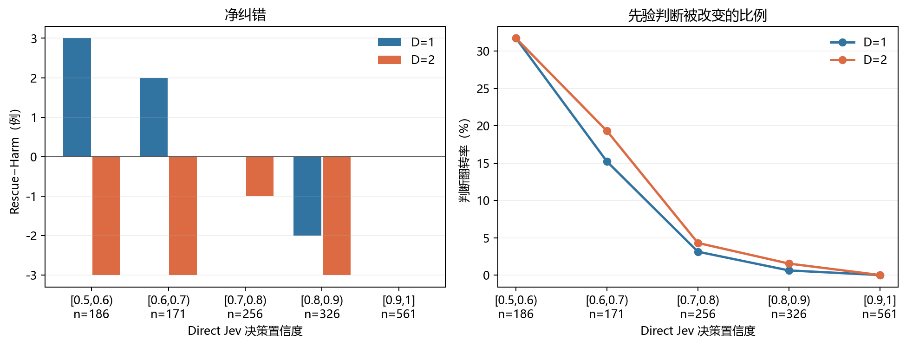

# Direct Jev 置信度分桶与 Prior-EW-QBAF 修正分析

生成时间：2026-09-27 13:13:25 中国标准时间

## 定义

- 使用现有逐样本结果：`experiment_results/pro_0813_full/data`；没有发起 API 请求。
- `direct_jev` 给出论点为真的概率 p。分桶所用置信度为 c=max(p,1−p)，即 Jev 对其所选真假类别的置信度。因此真假两侧被对称分桶；恰好位于边界的样本进入右侧桶，1.0 进入末桶。
- 两种方法均以概率严格大于 0.5 判真。Rescue 指 Direct Jev 判错而 Prior-EW-QBAF 判对；Harm 指反方向。Rescue−Harm 除以桶内样本数，恰好等于后者减前者的 Accuracy。
- Brier 是真类概率与 0/1 标签的平方误差均值；翻转率为两方法真假判断不同的样本占比。95% 区间对同一桶的逐样本差值做 2000 次配对重抽样，未经多重比较校正。
- D=1 与 D=2 共享同一批根论点；以下按深度分开计算，不会将两个深度当作独立样本合并。

## 三数据集合计

| 深度 | Jev 置信度桶 | n | Direct Acc | Prior-EW Acc | Rescue | Harm | Rescue−Harm | Direct Brier | Prior-EW Brier | 翻转率 |
|---|---|---:|---:|---:|---:|---:|---:|---:|---:|---:|
| D=1 | [0.5,0.6) | 186 | 0.5376 | 0.5538 | 31 | 28 | +3 | 0.2480 | 0.2576 | 0.3172 |
| D=1 | [0.6,0.7) | 171 | 0.6608 | 0.6725 | 14 | 12 | +2 | 0.2246 | 0.2092 | 0.1520 |
| D=1 | [0.7,0.8) | 256 | 0.7578 | 0.7578 | 4 | 4 | +0 | 0.1813 | 0.1866 | 0.0312 |
| D=1 | [0.8,0.9) | 326 | 0.8773 | 0.8712 | 0 | 2 | -2 | 0.1067 | 0.1148 | 0.0061 |
| D=1 | [0.9,1] | 561 | 0.9643 | 0.9643 | 0 | 0 | +0 | 0.0348 | 0.0355 | 0.0000 |
| D=2 | [0.5,0.6) | 186 | 0.5376 | 0.5215 | 28 | 31 | -3 | 0.2480 | 0.2699 | 0.3172 |
| D=2 | [0.6,0.7) | 171 | 0.6608 | 0.6433 | 15 | 18 | -3 | 0.2246 | 0.2315 | 0.1930 |
| D=2 | [0.7,0.8) | 256 | 0.7578 | 0.7539 | 5 | 6 | -1 | 0.1813 | 0.1883 | 0.0430 |
| D=2 | [0.8,0.9) | 326 | 0.8773 | 0.8681 | 1 | 4 | -3 | 0.1067 | 0.1169 | 0.0153 |
| D=2 | [0.9,1] | 561 | 0.9643 | 0.9643 | 0 | 0 | +0 | 0.0348 | 0.0357 | 0.0000 |

## 接近阈值与高置信对照

| 深度 | 范围 | n | Rescue | Harm | Rescue−Harm | ΔAccuracy [95%区间] | ΔBrier [95%区间] | 翻转率 |
|---|---|---:|---:|---:|---:|---:|---:|---:|
| D=1 | 接近阈值 [0.5,0.7) | 357 | 45 | 40 | +5 | +0.0140 [-0.0336, +0.0672] | -0.0024 [-0.0186, +0.0128] | 0.2381 |
| D=1 | 高置信 [0.9,1] | 561 | 0 | 0 | +0 | +0.0000 [+0.0000, +0.0000] | +0.0007 [-0.0007, +0.0023] | 0.0000 |
| D=2 | 接近阈值 [0.5,0.7) | 357 | 43 | 49 | -6 | -0.0168 [-0.0700, +0.0364] | +0.0147 [-0.0042, +0.0327] | 0.2577 |
| D=2 | 高置信 [0.9,1] | 561 | 0 | 0 | +0 | +0.0000 [+0.0000, +0.0000] | +0.0009 [-0.0005, +0.0026] | 0.0000 |

## 各数据集分桶

| 数据集 | 深度 | Jev 置信度桶 | n | Direct Acc | Prior-EW Acc | Rescue | Harm | Rescue−Harm | Direct Brier | Prior-EW Brier | 翻转率 |
|---|---|---|---:|---:|---:|---:|---:|---:|---:|---:|---:|
| TruthfulClaim | D=1 | [0.5,0.6) | 38 | 0.5526 | 0.5526 | 5 | 5 | +0 | 0.2540 | 0.2541 | 0.2632 |
| TruthfulClaim | D=1 | [0.6,0.7) | 52 | 0.6346 | 0.5962 | 3 | 5 | -2 | 0.2290 | 0.2405 | 0.1538 |
| TruthfulClaim | D=1 | [0.7,0.8) | 68 | 0.8088 | 0.8529 | 4 | 1 | +3 | 0.1567 | 0.1400 | 0.0735 |
| TruthfulClaim | D=1 | [0.8,0.9) | 120 | 0.9417 | 0.9333 | 0 | 1 | -1 | 0.0638 | 0.0620 | 0.0083 |
| TruthfulClaim | D=1 | [0.9,1] | 222 | 0.9595 | 0.9595 | 0 | 0 | +0 | 0.0391 | 0.0408 | 0.0000 |
| StrategyClaim | D=1 | [0.5,0.6) | 84 | 0.4762 | 0.4762 | 14 | 14 | +0 | 0.2529 | 0.3001 | 0.3333 |
| StrategyClaim | D=1 | [0.6,0.7) | 71 | 0.7042 | 0.6761 | 3 | 5 | -2 | 0.2120 | 0.1955 | 0.1127 |
| StrategyClaim | D=1 | [0.7,0.8) | 88 | 0.7386 | 0.7386 | 0 | 0 | +0 | 0.1918 | 0.1979 | 0.0000 |
| StrategyClaim | D=1 | [0.8,0.9) | 95 | 0.8421 | 0.8316 | 0 | 1 | -1 | 0.1308 | 0.1494 | 0.0105 |
| StrategyClaim | D=1 | [0.9,1] | 162 | 0.9691 | 0.9691 | 0 | 0 | +0 | 0.0297 | 0.0301 | 0.0000 |
| MedClaim | D=1 | [0.5,0.6) | 64 | 0.6094 | 0.6562 | 12 | 9 | +3 | 0.2382 | 0.2038 | 0.3281 |
| MedClaim | D=1 | [0.6,0.7) | 48 | 0.6250 | 0.7500 | 8 | 2 | +6 | 0.2383 | 0.1957 | 0.2083 |
| MedClaim | D=1 | [0.7,0.8) | 100 | 0.7400 | 0.7100 | 0 | 3 | -3 | 0.1889 | 0.2084 | 0.0300 |
| MedClaim | D=1 | [0.8,0.9) | 111 | 0.8378 | 0.8378 | 0 | 0 | +0 | 0.1325 | 0.1421 | 0.0000 |
| MedClaim | D=1 | [0.9,1] | 177 | 0.9661 | 0.9661 | 0 | 0 | +0 | 0.0339 | 0.0337 | 0.0000 |
| TruthfulClaim | D=2 | [0.5,0.6) | 38 | 0.5526 | 0.5263 | 5 | 6 | -1 | 0.2540 | 0.2523 | 0.2895 |
| TruthfulClaim | D=2 | [0.6,0.7) | 52 | 0.6346 | 0.6154 | 5 | 6 | -1 | 0.2290 | 0.2555 | 0.2115 |
| TruthfulClaim | D=2 | [0.7,0.8) | 68 | 0.8088 | 0.8382 | 4 | 2 | +2 | 0.1567 | 0.1478 | 0.0882 |
| TruthfulClaim | D=2 | [0.8,0.9) | 120 | 0.9417 | 0.9167 | 0 | 3 | -3 | 0.0638 | 0.0727 | 0.0250 |
| TruthfulClaim | D=2 | [0.9,1] | 222 | 0.9595 | 0.9595 | 0 | 0 | +0 | 0.0391 | 0.0419 | 0.0000 |
| StrategyClaim | D=2 | [0.5,0.6) | 84 | 0.4762 | 0.4643 | 14 | 15 | -1 | 0.2529 | 0.3135 | 0.3452 |
| StrategyClaim | D=2 | [0.6,0.7) | 71 | 0.7042 | 0.6338 | 3 | 8 | -5 | 0.2120 | 0.2217 | 0.1549 |
| StrategyClaim | D=2 | [0.7,0.8) | 88 | 0.7386 | 0.7273 | 0 | 1 | -1 | 0.1918 | 0.1998 | 0.0114 |
| StrategyClaim | D=2 | [0.8,0.9) | 95 | 0.8421 | 0.8316 | 0 | 1 | -1 | 0.1308 | 0.1429 | 0.0105 |
| StrategyClaim | D=2 | [0.9,1] | 162 | 0.9691 | 0.9691 | 0 | 0 | +0 | 0.0297 | 0.0293 | 0.0000 |
| MedClaim | D=2 | [0.5,0.6) | 64 | 0.6094 | 0.5938 | 9 | 10 | -1 | 0.2382 | 0.2231 | 0.2969 |
| MedClaim | D=2 | [0.6,0.7) | 48 | 0.6250 | 0.6875 | 7 | 4 | +3 | 0.2383 | 0.2201 | 0.2292 |
| MedClaim | D=2 | [0.7,0.8) | 100 | 0.7400 | 0.7200 | 1 | 3 | -2 | 0.1889 | 0.2059 | 0.0400 |
| MedClaim | D=2 | [0.8,0.9) | 111 | 0.8378 | 0.8468 | 1 | 0 | +1 | 0.1325 | 0.1425 | 0.0090 |
| MedClaim | D=2 | [0.9,1] | 177 | 0.9661 | 0.9661 | 0 | 0 | +0 | 0.0339 | 0.0336 | 0.0000 |

## 对假设的判断

- D=1：最接近 0.5 的桶翻转 59/186 条，Rescue/Harm 为 31/28，Brier 从 0.2480 变为 0.2576；合并的 [0.5,0.7) 区间 Rescue−Harm 为 +5。高置信 [0.9,1] 桶翻转 0/561 条，Rescue/Harm 为 0/0。
- D=2：最接近 0.5 的桶翻转 59/186 条，Rescue/Harm 为 28/31，Brier 从 0.2480 变为 0.2699；合并的 [0.5,0.7) 区间 Rescue−Harm 为 -6。高置信 [0.9,1] 桶翻转 0/561 条，Rescue/Harm 为 0/0。
- 高置信桶翻转极少，现有数据更直接支持“结构化论证几乎不改变高置信判断”；仅凭稀少的翻转，不能断言它在该桶有稳定的有害或有益效果。低置信桶的净纠错方向随设置与深度变化；应结合配对区间判断，不能从这些分桶确认稳定的正价值。

本分析按已观察到的置信度分组，属于探索性条件比较。同一根论点的两个深度不可当作独立重复，单个数据集的小桶也应结合样本数解读。

全部逐桶数值及配对区间见 [指标 JSON](2026-09-27_pro0813_置信度分桶指标.json)。
