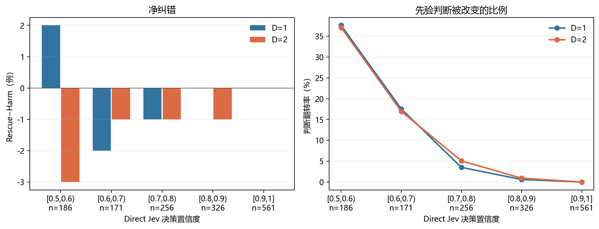

# Direct Jev 置信度分桶与 Prior-EW-QBAF 修正分析

生成时间：2026-09-27 21:11:20 中国标准时间

## 定义

- 使用现有逐样本结果：`experiment_results/qwen38_27b_full/data`；没有发起 API 请求。
- `direct_jev` 给出论点为真的概率 p。分桶所用置信度为 c=max(p,1−p)，即 Jev 对其所选真假类别的置信度。因此真假两侧被对称分桶；恰好位于边界的样本进入右侧桶，1.0 进入末桶。
- 两种方法均以概率严格大于 0.5 判真。Rescue 指 Direct Jev 判错而 Prior-EW-QBAF 判对；Harm 指反方向。Rescue−Harm 除以桶内样本数，恰好等于后者减前者的 Accuracy。
- Brier 是真类概率与 0/1 标签的平方误差均值；翻转率为两方法真假判断不同的样本占比。95% 区间对同一桶的逐样本差值做 2000 次配对重抽样，未经多重比较校正。
- D=1 与 D=2 共享同一批根论点；以下按深度分开计算，不会将两个深度当作独立样本合并。

## 三数据集合计

| 深度 | Jev 置信度桶 | n | Direct Acc | Prior-EW Acc | Rescue | Harm | Rescue−Harm | Direct Brier | Prior-EW Brier | 翻转率 |
|---|---|---:|---:|---:|---:|---:|---:|---:|---:|---:|
| D=1 | [0.5,0.6) | 186 | 0.5376 | 0.5484 | 36 | 34 | +2 | 0.2480 | 0.2672 | 0.3763 |
| D=1 | [0.6,0.7) | 171 | 0.6608 | 0.6491 | 14 | 16 | -2 | 0.2246 | 0.2478 | 0.1754 |
| D=1 | [0.7,0.8) | 256 | 0.7578 | 0.7539 | 4 | 5 | -1 | 0.1813 | 0.1885 | 0.0352 |
| D=1 | [0.8,0.9) | 326 | 0.8773 | 0.8773 | 1 | 1 | +0 | 0.1067 | 0.1103 | 0.0061 |
| D=1 | [0.9,1] | 561 | 0.9643 | 0.9643 | 0 | 0 | +0 | 0.0348 | 0.0353 | 0.0000 |
| D=2 | [0.5,0.6) | 186 | 0.5376 | 0.5215 | 33 | 36 | -3 | 0.2480 | 0.2754 | 0.3710 |
| D=2 | [0.6,0.7) | 171 | 0.6608 | 0.6550 | 14 | 15 | -1 | 0.2246 | 0.2475 | 0.1696 |
| D=2 | [0.7,0.8) | 256 | 0.7578 | 0.7539 | 6 | 7 | -1 | 0.1813 | 0.1869 | 0.0508 |
| D=2 | [0.8,0.9) | 326 | 0.8773 | 0.8742 | 1 | 2 | -1 | 0.1067 | 0.1124 | 0.0092 |
| D=2 | [0.9,1] | 561 | 0.9643 | 0.9643 | 0 | 0 | +0 | 0.0348 | 0.0351 | 0.0000 |

## 接近阈值与高置信对照

| 深度 | 范围 | n | Rescue | Harm | Rescue−Harm | ΔAccuracy [95%区间] | ΔBrier [95%区间] | 翻转率 |
|---|---|---:|---:|---:|---:|---:|---:|---:|
| D=1 | 接近阈值 [0.5,0.7) | 357 | 50 | 50 | +0 | +0.0000 [-0.0532, +0.0560] | +0.0211 [+0.0017, +0.0414] | 0.2801 |
| D=1 | 高置信 [0.9,1] | 561 | 0 | 0 | +0 | +0.0000 [+0.0000, +0.0000] | +0.0006 [-0.0009, +0.0023] | 0.0000 |
| D=2 | 接近阈值 [0.5,0.7) | 357 | 47 | 51 | -4 | -0.0112 [-0.0644, +0.0420] | +0.0252 [+0.0045, +0.0456] | 0.2745 |
| D=2 | 高置信 [0.9,1] | 561 | 0 | 0 | +0 | +0.0000 [+0.0000, +0.0000] | +0.0003 [-0.0010, +0.0018] | 0.0000 |

## 各数据集分桶

| 数据集 | 深度 | Jev 置信度桶 | n | Direct Acc | Prior-EW Acc | Rescue | Harm | Rescue−Harm | Direct Brier | Prior-EW Brier | 翻转率 |
|---|---|---|---:|---:|---:|---:|---:|---:|---:|---:|---:|
| TruthfulClaim | D=1 | [0.5,0.6) | 38 | 0.5526 | 0.4474 | 5 | 9 | -4 | 0.2540 | 0.2883 | 0.3684 |
| TruthfulClaim | D=1 | [0.6,0.7) | 52 | 0.6346 | 0.6346 | 4 | 4 | +0 | 0.2290 | 0.2673 | 0.1538 |
| TruthfulClaim | D=1 | [0.7,0.8) | 68 | 0.8088 | 0.7941 | 0 | 1 | -1 | 0.1567 | 0.1546 | 0.0147 |
| TruthfulClaim | D=1 | [0.8,0.9) | 120 | 0.9417 | 0.9500 | 1 | 0 | +1 | 0.0638 | 0.0547 | 0.0083 |
| TruthfulClaim | D=1 | [0.9,1] | 222 | 0.9595 | 0.9595 | 0 | 0 | +0 | 0.0391 | 0.0404 | 0.0000 |
| StrategyClaim | D=1 | [0.5,0.6) | 84 | 0.4762 | 0.5238 | 18 | 14 | +4 | 0.2529 | 0.2783 | 0.3810 |
| StrategyClaim | D=1 | [0.6,0.7) | 71 | 0.7042 | 0.6620 | 6 | 9 | -3 | 0.2120 | 0.2533 | 0.2113 |
| StrategyClaim | D=1 | [0.7,0.8) | 88 | 0.7386 | 0.7614 | 4 | 2 | +2 | 0.1918 | 0.1848 | 0.0682 |
| StrategyClaim | D=1 | [0.8,0.9) | 95 | 0.8421 | 0.8316 | 0 | 1 | -1 | 0.1308 | 0.1425 | 0.0105 |
| StrategyClaim | D=1 | [0.9,1] | 162 | 0.9691 | 0.9691 | 0 | 0 | +0 | 0.0297 | 0.0299 | 0.0000 |
| MedClaim | D=1 | [0.5,0.6) | 64 | 0.6094 | 0.6406 | 13 | 11 | +2 | 0.2382 | 0.2400 | 0.3750 |
| MedClaim | D=1 | [0.6,0.7) | 48 | 0.6250 | 0.6458 | 4 | 3 | +1 | 0.2383 | 0.2185 | 0.1458 |
| MedClaim | D=1 | [0.7,0.8) | 100 | 0.7400 | 0.7200 | 0 | 2 | -2 | 0.1889 | 0.2149 | 0.0200 |
| MedClaim | D=1 | [0.8,0.9) | 111 | 0.8378 | 0.8378 | 0 | 0 | +0 | 0.1325 | 0.1428 | 0.0000 |
| MedClaim | D=1 | [0.9,1] | 177 | 0.9661 | 0.9661 | 0 | 0 | +0 | 0.0339 | 0.0340 | 0.0000 |
| TruthfulClaim | D=2 | [0.5,0.6) | 38 | 0.5526 | 0.4474 | 5 | 9 | -4 | 0.2540 | 0.2915 | 0.3684 |
| TruthfulClaim | D=2 | [0.6,0.7) | 52 | 0.6346 | 0.6154 | 4 | 5 | -1 | 0.2290 | 0.2641 | 0.1731 |
| TruthfulClaim | D=2 | [0.7,0.8) | 68 | 0.8088 | 0.8235 | 2 | 1 | +1 | 0.1567 | 0.1478 | 0.0441 |
| TruthfulClaim | D=2 | [0.8,0.9) | 120 | 0.9417 | 0.9417 | 1 | 1 | +0 | 0.0638 | 0.0596 | 0.0167 |
| TruthfulClaim | D=2 | [0.9,1] | 222 | 0.9595 | 0.9595 | 0 | 0 | +0 | 0.0391 | 0.0405 | 0.0000 |
| StrategyClaim | D=2 | [0.5,0.6) | 84 | 0.4762 | 0.5000 | 17 | 15 | +2 | 0.2529 | 0.2906 | 0.3810 |
| StrategyClaim | D=2 | [0.6,0.7) | 71 | 0.7042 | 0.6479 | 4 | 8 | -4 | 0.2120 | 0.2598 | 0.1690 |
| StrategyClaim | D=2 | [0.7,0.8) | 88 | 0.7386 | 0.7500 | 4 | 3 | +1 | 0.1918 | 0.1808 | 0.0795 |
| StrategyClaim | D=2 | [0.8,0.9) | 95 | 0.8421 | 0.8316 | 0 | 1 | -1 | 0.1308 | 0.1433 | 0.0105 |
| StrategyClaim | D=2 | [0.9,1] | 162 | 0.9691 | 0.9691 | 0 | 0 | +0 | 0.0297 | 0.0297 | 0.0000 |
| MedClaim | D=2 | [0.5,0.6) | 64 | 0.6094 | 0.5938 | 11 | 12 | -1 | 0.2382 | 0.2461 | 0.3594 |
| MedClaim | D=2 | [0.6,0.7) | 48 | 0.6250 | 0.7083 | 6 | 2 | +4 | 0.2383 | 0.2112 | 0.1667 |
| MedClaim | D=2 | [0.7,0.8) | 100 | 0.7400 | 0.7100 | 0 | 3 | -3 | 0.1889 | 0.2189 | 0.0300 |
| MedClaim | D=2 | [0.8,0.9) | 111 | 0.8378 | 0.8378 | 0 | 0 | +0 | 0.1325 | 0.1429 | 0.0000 |
| MedClaim | D=2 | [0.9,1] | 177 | 0.9661 | 0.9661 | 0 | 0 | +0 | 0.0339 | 0.0334 | 0.0000 |

## 对假设的判断

- D=1：最接近 0.5 的桶翻转 70/186 条，Rescue/Harm 为 36/34，Brier 从 0.2480 变为 0.2672；合并的 [0.5,0.7) 区间 Rescue−Harm 为 +0。高置信 [0.9,1] 桶翻转 0/561 条，Rescue/Harm 为 0/0。
- D=2：最接近 0.5 的桶翻转 69/186 条，Rescue/Harm 为 33/36，Brier 从 0.2480 变为 0.2754；合并的 [0.5,0.7) 区间 Rescue−Harm 为 -4。高置信 [0.9,1] 桶翻转 0/561 条，Rescue/Harm 为 0/0。
- [0.5,0.7) 区间两个深度的 Brier 都升高，其逐样本配对 95% 区间下界均大于 0。
- 高置信桶翻转极少，现有数据更直接支持“结构化论证几乎不改变高置信判断”；仅凭稀少的翻转，不能断言它在该桶有稳定的有害或有益效果。低置信桶的净纠错方向随设置与深度变化；应结合配对区间判断，不能从这些分桶确认稳定的正价值。

本分析按已观察到的置信度分组，属于探索性条件比较。同一根论点的两个深度不可当作独立重复，单个数据集的小桶也应结合样本数解读。

全部逐桶数值及配对区间见 [指标 JSON](2026-09-27_qwen38_27b_置信度分桶指标.json)。
