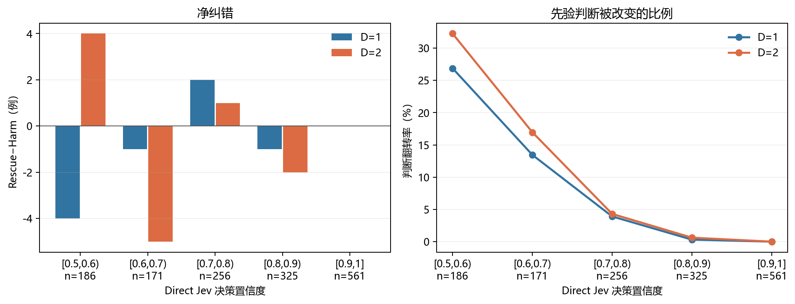

# Direct Jev 置信度分桶与 Prior-EW-QBAF 修正分析

生成时间：2026-09-27 22:36:34 中国标准时间

## 定义

- 使用现有逐样本结果：`experiment_results/qwen3_8b_full/data`；没有发起 API 请求。
- `direct_jev` 给出论点为真的概率 p。分桶所用置信度为 c=max(p,1−p)，即 Jev 对其所选真假类别的置信度。因此真假两侧被对称分桶；恰好位于边界的样本进入右侧桶，1.0 进入末桶。
- 两种方法均以概率严格大于 0.5 判真。Rescue 指 Direct Jev 判错而 Prior-EW-QBAF 判对；Harm 指反方向。Rescue−Harm 除以桶内样本数，恰好等于后者减前者的 Accuracy。
- Brier 是真类概率与 0/1 标签的平方误差均值；翻转率为两方法真假判断不同的样本占比。95% 区间对同一桶的逐样本差值做 2000 次配对重抽样，未经多重比较校正。
- D=1 与 D=2 共享同一批根论点；以下按深度分开计算，不会将两个深度当作独立样本合并。

## 三数据集合计

| 深度 | Jev 置信度桶 | n | Direct Acc | Prior-EW Acc | Rescue | Harm | Rescue−Harm | Direct Brier | Prior-EW Brier | 翻转率 |
|---|---|---:|---:|---:|---:|---:|---:|---:|---:|---:|
| D=1 | [0.5,0.6) | 186 | 0.5376 | 0.5161 | 23 | 27 | -4 | 0.2480 | 0.2554 | 0.2688 |
| D=1 | [0.6,0.7) | 171 | 0.6608 | 0.6550 | 11 | 12 | -1 | 0.2246 | 0.2263 | 0.1345 |
| D=1 | [0.7,0.8) | 256 | 0.7578 | 0.7656 | 6 | 4 | +2 | 0.1813 | 0.1785 | 0.0391 |
| D=1 | [0.8,0.9) | 325 | 0.8769 | 0.8738 | 0 | 1 | -1 | 0.1070 | 0.1118 | 0.0031 |
| D=1 | [0.9,1] | 561 | 0.9643 | 0.9643 | 0 | 0 | +0 | 0.0348 | 0.0348 | 0.0000 |
| D=2 | [0.5,0.6) | 186 | 0.5376 | 0.5591 | 32 | 28 | +4 | 0.2480 | 0.2561 | 0.3226 |
| D=2 | [0.6,0.7) | 171 | 0.6608 | 0.6316 | 12 | 17 | -5 | 0.2246 | 0.2314 | 0.1696 |
| D=2 | [0.7,0.8) | 256 | 0.7578 | 0.7617 | 6 | 5 | +1 | 0.1813 | 0.1771 | 0.0430 |
| D=2 | [0.8,0.9) | 325 | 0.8769 | 0.8708 | 0 | 2 | -2 | 0.1070 | 0.1116 | 0.0062 |
| D=2 | [0.9,1] | 561 | 0.9643 | 0.9643 | 0 | 0 | +0 | 0.0348 | 0.0353 | 0.0000 |

## 接近阈值与高置信对照

| 深度 | 范围 | n | Rescue | Harm | Rescue−Harm | ΔAccuracy [95%区间] | ΔBrier [95%区间] | 翻转率 |
|---|---|---:|---:|---:|---:|---:|---:|---:|
| D=1 | 接近阈值 [0.5,0.7) | 357 | 34 | 39 | -5 | -0.0140 [-0.0588, +0.0308] | +0.0046 [-0.0091, +0.0194] | 0.2045 |
| D=1 | 高置信 [0.9,1] | 561 | 0 | 0 | +0 | +0.0000 [+0.0000, +0.0000] | +0.0001 [-0.0011, +0.0014] | 0.0000 |
| D=2 | 接近阈值 [0.5,0.7) | 357 | 44 | 45 | -1 | -0.0028 [-0.0532, +0.0476] | +0.0075 [-0.0079, +0.0234] | 0.2493 |
| D=2 | 高置信 [0.9,1] | 561 | 0 | 0 | +0 | +0.0000 [+0.0000, +0.0000] | +0.0006 [-0.0007, +0.0020] | 0.0000 |

## 各数据集分桶

| 数据集 | 深度 | Jev 置信度桶 | n | Direct Acc | Prior-EW Acc | Rescue | Harm | Rescue−Harm | Direct Brier | Prior-EW Brier | 翻转率 |
|---|---|---|---:|---:|---:|---:|---:|---:|---:|---:|---:|
| TruthfulClaim | D=1 | [0.5,0.6) | 38 | 0.5526 | 0.6053 | 6 | 4 | +2 | 0.2540 | 0.2446 | 0.2632 |
| TruthfulClaim | D=1 | [0.6,0.7) | 52 | 0.6346 | 0.6154 | 3 | 4 | -1 | 0.2290 | 0.2541 | 0.1346 |
| TruthfulClaim | D=1 | [0.7,0.8) | 68 | 0.8088 | 0.8235 | 3 | 2 | +1 | 0.1567 | 0.1396 | 0.0735 |
| TruthfulClaim | D=1 | [0.8,0.9) | 119 | 0.9412 | 0.9328 | 0 | 1 | -1 | 0.0642 | 0.0647 | 0.0084 |
| TruthfulClaim | D=1 | [0.9,1] | 222 | 0.9595 | 0.9595 | 0 | 0 | +0 | 0.0391 | 0.0389 | 0.0000 |
| StrategyClaim | D=1 | [0.5,0.6) | 84 | 0.4762 | 0.4167 | 7 | 12 | -5 | 0.2529 | 0.2730 | 0.2262 |
| StrategyClaim | D=1 | [0.6,0.7) | 71 | 0.7042 | 0.6620 | 3 | 6 | -3 | 0.2120 | 0.2148 | 0.1268 |
| StrategyClaim | D=1 | [0.7,0.8) | 88 | 0.7386 | 0.7614 | 2 | 0 | +2 | 0.1918 | 0.1904 | 0.0227 |
| StrategyClaim | D=1 | [0.8,0.9) | 95 | 0.8421 | 0.8421 | 0 | 0 | +0 | 0.1308 | 0.1355 | 0.0000 |
| StrategyClaim | D=1 | [0.9,1] | 162 | 0.9691 | 0.9691 | 0 | 0 | +0 | 0.0297 | 0.0307 | 0.0000 |
| MedClaim | D=1 | [0.5,0.6) | 64 | 0.6094 | 0.5938 | 10 | 11 | -1 | 0.2382 | 0.2386 | 0.3281 |
| MedClaim | D=1 | [0.6,0.7) | 48 | 0.6250 | 0.6875 | 5 | 2 | +3 | 0.2383 | 0.2131 | 0.1458 |
| MedClaim | D=1 | [0.7,0.8) | 100 | 0.7400 | 0.7300 | 1 | 2 | -1 | 0.1889 | 0.1945 | 0.0300 |
| MedClaim | D=1 | [0.8,0.9) | 111 | 0.8378 | 0.8378 | 0 | 0 | +0 | 0.1325 | 0.1420 | 0.0000 |
| MedClaim | D=1 | [0.9,1] | 177 | 0.9661 | 0.9661 | 0 | 0 | +0 | 0.0339 | 0.0334 | 0.0000 |
| TruthfulClaim | D=2 | [0.5,0.6) | 38 | 0.5526 | 0.6579 | 8 | 4 | +4 | 0.2540 | 0.2433 | 0.3158 |
| TruthfulClaim | D=2 | [0.6,0.7) | 52 | 0.6346 | 0.5962 | 3 | 5 | -2 | 0.2290 | 0.2638 | 0.1538 |
| TruthfulClaim | D=2 | [0.7,0.8) | 68 | 0.8088 | 0.8235 | 2 | 1 | +1 | 0.1567 | 0.1363 | 0.0441 |
| TruthfulClaim | D=2 | [0.8,0.9) | 119 | 0.9412 | 0.9328 | 0 | 1 | -1 | 0.0642 | 0.0637 | 0.0084 |
| TruthfulClaim | D=2 | [0.9,1] | 222 | 0.9595 | 0.9595 | 0 | 0 | +0 | 0.0391 | 0.0399 | 0.0000 |
| StrategyClaim | D=2 | [0.5,0.6) | 84 | 0.4762 | 0.5000 | 14 | 12 | +2 | 0.2529 | 0.2632 | 0.3095 |
| StrategyClaim | D=2 | [0.6,0.7) | 71 | 0.7042 | 0.6338 | 4 | 9 | -5 | 0.2120 | 0.2178 | 0.1831 |
| StrategyClaim | D=2 | [0.7,0.8) | 88 | 0.7386 | 0.7273 | 2 | 3 | -1 | 0.1918 | 0.1921 | 0.0568 |
| StrategyClaim | D=2 | [0.8,0.9) | 95 | 0.8421 | 0.8316 | 0 | 1 | -1 | 0.1308 | 0.1363 | 0.0105 |
| StrategyClaim | D=2 | [0.9,1] | 162 | 0.9691 | 0.9691 | 0 | 0 | +0 | 0.0297 | 0.0312 | 0.0000 |
| MedClaim | D=2 | [0.5,0.6) | 64 | 0.6094 | 0.5781 | 10 | 12 | -2 | 0.2382 | 0.2545 | 0.3438 |
| MedClaim | D=2 | [0.6,0.7) | 48 | 0.6250 | 0.6667 | 5 | 3 | +2 | 0.2383 | 0.2166 | 0.1667 |
| MedClaim | D=2 | [0.7,0.8) | 100 | 0.7400 | 0.7500 | 2 | 1 | +1 | 0.1889 | 0.1917 | 0.0300 |
| MedClaim | D=2 | [0.8,0.9) | 111 | 0.8378 | 0.8378 | 0 | 0 | +0 | 0.1325 | 0.1418 | 0.0000 |
| MedClaim | D=2 | [0.9,1] | 177 | 0.9661 | 0.9661 | 0 | 0 | +0 | 0.0339 | 0.0334 | 0.0000 |

## 对假设的判断

- D=1：最接近 0.5 的桶翻转 50/186 条，Rescue/Harm 为 23/27，Brier 从 0.2480 变为 0.2554；合并的 [0.5,0.7) 区间 Rescue−Harm 为 -5。高置信 [0.9,1] 桶翻转 0/561 条，Rescue/Harm 为 0/0。
- D=2：最接近 0.5 的桶翻转 60/186 条，Rescue/Harm 为 32/28，Brier 从 0.2480 变为 0.2561；合并的 [0.5,0.7) 区间 Rescue−Harm 为 -1。高置信 [0.9,1] 桶翻转 0/561 条，Rescue/Harm 为 0/0。
- 高置信桶翻转极少，现有数据更直接支持“结构化论证几乎不改变高置信判断”；仅凭稀少的翻转，不能断言它在该桶有稳定的有害或有益效果。低置信桶的净纠错方向随设置与深度变化；应结合配对区间判断，不能从这些分桶确认稳定的正价值。

本分析按已观察到的置信度分组，属于探索性条件比较。同一根论点的两个深度不可当作独立重复，单个数据集的小桶也应结合样本数解读。

全部逐桶数值及配对区间见 [指标 JSON](2026-09-27_qwen3_8b_置信度分桶指标.json)。
